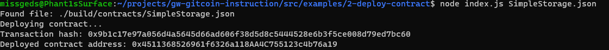

https://gitcoin.co/issue/nervosnetwork/grants/3/100026209

1. A screenshot of the console output immediately after you have successfully deployed a smart contract.

2. The transaction hash from the contract deployment (in text format).
0x9b1c17e97a056d4a5645d66ad606f38d5d8c5444528e6b3f5ce008d79ed7bc60

3. The deployed contract address from the contract deployment (in text format).
0x4511368526961f6326a118AA4C755123c4b76a19
