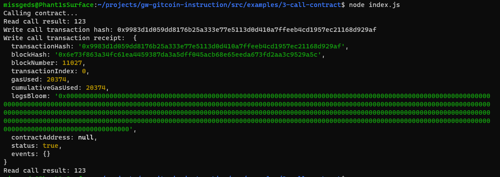

https://gitcoin.co/issue/nervosnetwork/grants/4/100026210

1. A screenshot of the console output immediately after you have successfully issued a smart contract call.

2. The transaction hash from the console output (in text format).
transactionHash: '0x9983d1d059dd8176b25a333e77e5113d0d410a7ffeeb4cd1957ec21168d929af'

3. The contract address that you called (in text format).
CONTRACT_ADDRESS = '0x4511368526961f6326a118AA4C755123c4b76a19'

4. The ABI for contract you made a call on (in text format).
  "abi": [
    {
      "inputs": [],
      "stateMutability": "payable",
      "type": "constructor"
    },
    {
      "inputs": [
        {
          "internalType": "uint256",
          "name": "x",
          "type": "uint256"
        }
      ],
      "name": "set",
      "outputs": [],
      "stateMutability": "payable",
      "type": "function"
    },
    {
      "inputs": [],
      "name": "get",
      "outputs": [
        {
          "internalType": "uint256",
          "name": "",
          "type": "uint256"
        }
      ],
      "stateMutability": "view",
      "type": "function"
    }
  ]
