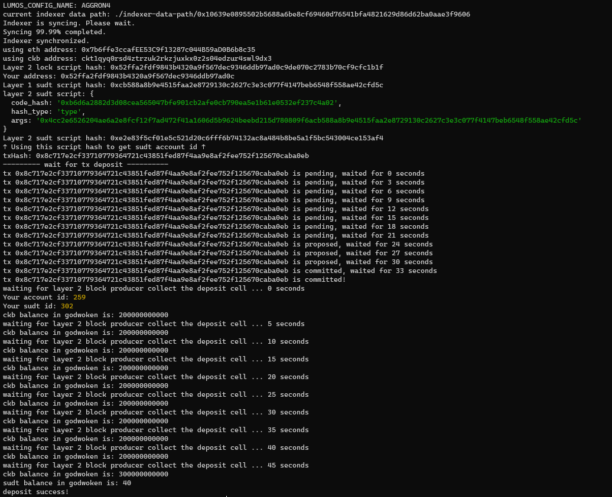

https://gitcoin.co/issue/nervosnetwork/grants/5/100026211

1. A link to the Layer 1 address you funded on the Testnet Explorer.
   https://explorer.nervos.org/aggron/address/ckt1qyq0rsd4ztrzuk2rkzjuxkx0z2s04edzur4swl9dx3
   
2. A screenshot of the console output immediately after using sudt-cli to create your SUDT tokens on Layer 1.

3. A link to the transaction ID created by sudt-cli on the Testnet Explorer.
https://explorer.nervos.org/aggron/transaction/0x38378c200454cca4b8a7a015f094885f2ea5096e96690a281e2dbfc86b83e71e

4. A screenshot of the console output immediately after you have successfully submitted a deposit to Layer 2 using the account-cli tool.

5. The SUDT ID from the console output after executing the deposit script (in text format).
Your sudt id: 302
