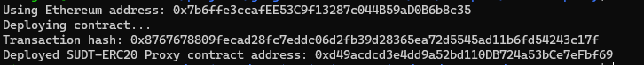
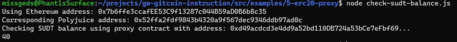

https://gitcoin.co/issue/nervosnetwork/grants/6/100026212

1. A screenshot of the console output immediately after deploying smart contract.
   

2. The address of the ERC20 Proxy Contract you deployed (in text format).
0xd49acdcd3e4dd9a52bd110DB724a53bCe7eFbf69

3. A screenshot of the console output immediately after checking your SUDT balance.
   

4. The Ethereum address that was checked (in text format).
0x7b6ffe3ccafEE53C9f13287c044B59aD0B6b8c35
