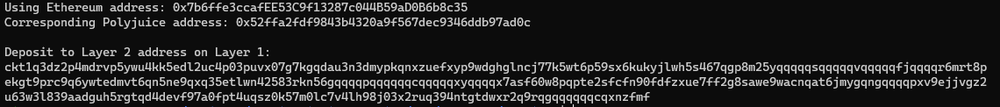

https://gitcoin.co/issue/nervosnetwork/grants/7/100026213

1. A screenshot of the console output immediately after you have successfully generated your Deposit Receiver Address.
   

2. Your Deposit Receiver Address (in text format).
ckt1q3dz2p4mdrvp5ywu4kk5edl2uc4p03puvx07g7kgqdau3n3dmypkqnxzuefxyp9wdghglncj77k5wt6p59sx6kukyjlwh5s467qgp8m25yqqqqqsqqqqqvqqqqqfjqqqqr6mrt8pekgt9prc9q6ywtedmvt6qn5ne9qxq35etlwn42583rkn56gqqqqpqqqqqqcqqqqqxyqqqqx7asf60w8pqpte2sfcfn90fdfzxue7ff2g8sawe9wacnqat6jmygqngqqqqpxv9ejjvgz2u63w3l839aadguh5rgtqd4devf97a0fpt4uqsz0k57m0lc7v4lh98j03x2ruq394ntgtdwxr2q9rqgqqqqqqcqxnzfmf

3. The Ethereum address used to generate the Deposit Receiver Address (in text format).
0x7b6ffe3ccafEE53C9f13287c044B59aD0B6b8c35

4. A link to the Etherscan explorer for the successful Force Bridge transaction. This can be found on Force Bridge under History→Succeed.
https://rinkeby.etherscan.io/tx/0xdefa67200a852539dbd3756ab6ecadfd6ee6e4a92a4508bdbd5e02a62f9d475e

5. A link to the Nervos explorer for the successful Force bridge transaction. This can be found on Force Bridge under History→Succeed.
https://explorer.nervos.org/aggron/transaction/0xac455282d61dc07f75314021895dafc83ae5142a8b2d96b9a916d276e53235d0
