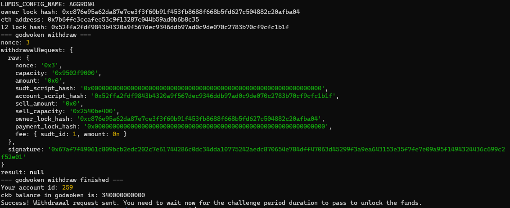

https://gitcoin.co/issue/nervosnetwork/grants/10/100026216

1. A screenshot of the console output immediately after running the withdraw command.

2. The Ethereum address that you've used for your Layer 2 account (in text format).
0x7b6ffe3ccafee53c9f13287c044b59ad0b6b8c35

3. The Nervos Layer 1 address that you passed to withdraw command (in text format).
ckt1qyq0rsd4ztrzuk2rkzjuxkx0z2s04edzur4swl9dx3 

